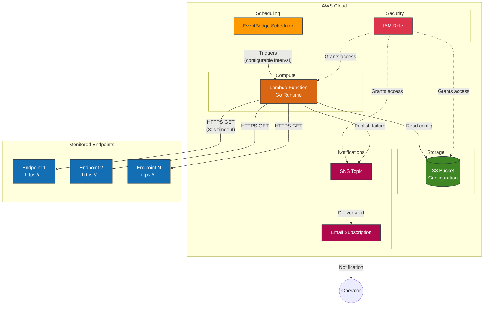
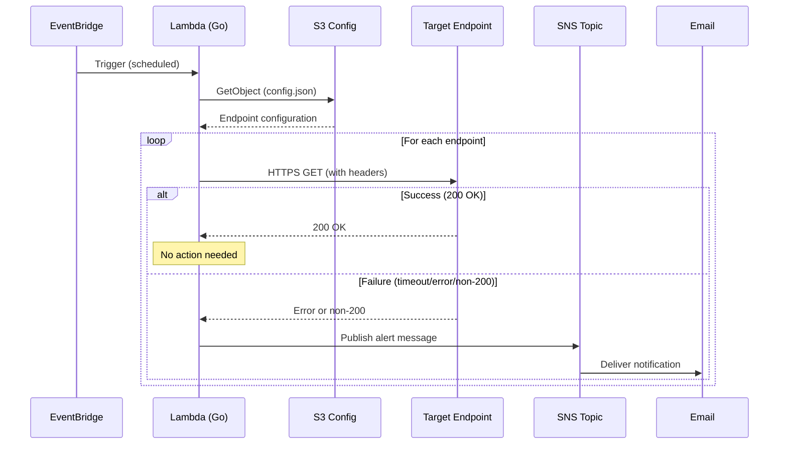
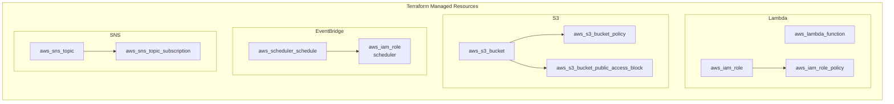
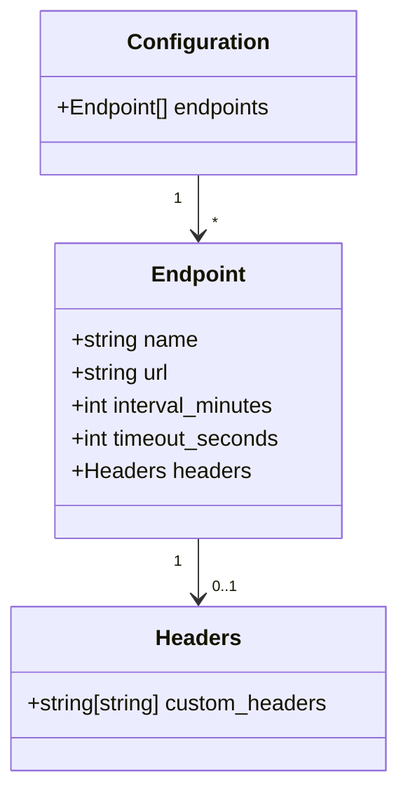
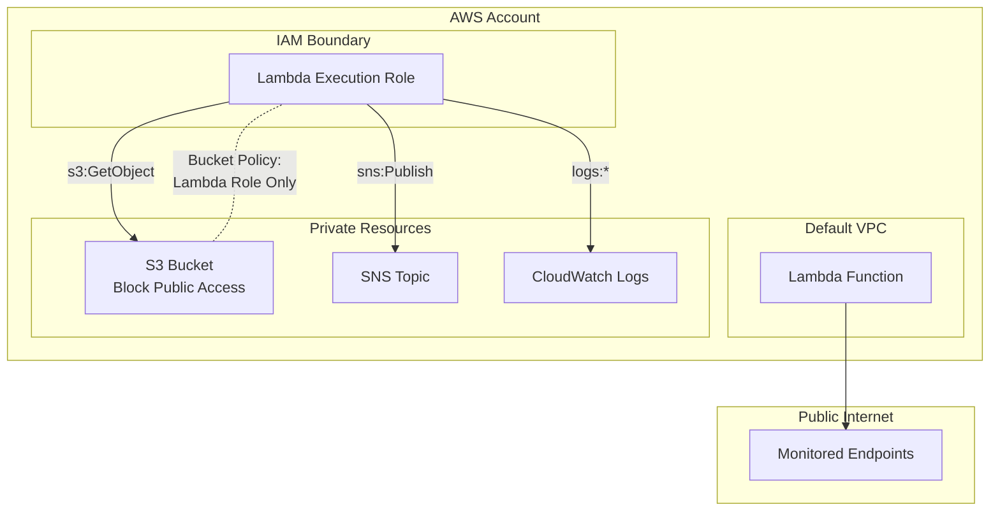
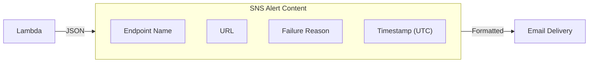

# Architecture Diagram

## System Overview

```mermaid
flowchart TB
    subgraph AWS["AWS Cloud"]
        subgraph Scheduling["Scheduling"]
            EB[EventBridge Scheduler]
        end

        subgraph Compute["Compute"]
            Lambda[Lambda Function<br/>Go Runtime]
        end

        subgraph Storage["Storage"]
            S3[(S3 Bucket<br/>Configuration)]
        end

        subgraph Notifications["Notifications"]
            SNS[SNS Topic]
            Email[Email Subscription]
        end

        subgraph Security["Security"]
            IAM[IAM Role]
        end
    end

    subgraph Targets["Monitored Endpoints"]
        EP1[Endpoint 1<br/>https://...]
        EP2[Endpoint 2<br/>https://...]
        EP3[Endpoint N<br/>https://...]
    end

    Operator((Operator))

    %% Flow
    EB -->|"Triggers<br/>(configurable interval)"| Lambda
    Lambda -->|"Read config"| S3
    IAM -.->|"Grants access"| Lambda
    IAM -.->|"Grants access"| S3
    IAM -.->|"Grants access"| SNS
    Lambda -->|"HTTPS GET<br/>(30s timeout)"| EP1
    Lambda -->|"HTTPS GET"| EP2
    Lambda -->|"HTTPS GET"| EP3
    Lambda -->|"Publish failure"| SNS
    SNS -->|"Deliver alert"| Email
    Email -->|"Notification"| Operator

    %% Styling
    classDef aws fill:#FF9900,stroke:#232F3E,color:#232F3E
    classDef storage fill:#3F8624,stroke:#232F3E,color:#fff
    classDef compute fill:#D86613,stroke:#232F3E,color:#fff
    classDef notification fill:#B0084D,stroke:#232F3E,color:#fff
    classDef security fill:#DD344C,stroke:#232F3E,color:#fff
    classDef external fill:#146EB4,stroke:#232F3E,color:#fff

    class EB aws
    class Lambda compute
    class S3 storage
    class SNS,Email notification
    class IAM security
    class EP1,EP2,EP3 external
```

## Data Flow Sequence

```mermaid
sequenceDiagram
    participant EB as EventBridge
    participant Lambda as Lambda (Go)
    participant S3 as S3 Config
    participant Endpoint as Target Endpoint
    participant SNS as SNS Topic
    participant Email as Email

    EB->>Lambda: Trigger (scheduled)
    Lambda->>S3: GetObject (config.json)
    S3-->>Lambda: Endpoint configuration

    loop For each endpoint
        Lambda->>Endpoint: HTTPS GET (with headers)
        alt Success (200 OK)
            Endpoint-->>Lambda: 200 OK
            Note over Lambda: No action needed
        else Failure (timeout/error/non-200)
            Endpoint-->>Lambda: Error or non-200
            Lambda->>SNS: Publish alert message
            SNS->>Email: Deliver notification
        end
    end
```

## Infrastructure Components

```mermaid
flowchart LR
    subgraph Terraform["Terraform Managed Resources"]
        subgraph lambda_resources["Lambda"]
            LF[aws_lambda_function]
            LR[aws_iam_role]
            LP[aws_iam_role_policy]
        end

        subgraph s3_resources["S3"]
            SB[aws_s3_bucket]
            SBP[aws_s3_bucket_policy]
            SBPAC[aws_s3_bucket_public_access_block]
        end

        subgraph eventbridge_resources["EventBridge"]
            ES[aws_scheduler_schedule]
            ESR[aws_iam_role<br/>scheduler]
        end

        subgraph sns_resources["SNS"]
            ST[aws_sns_topic]
            STS[aws_sns_topic_subscription]
        end
    end

    LR --> LP
    SB --> SBP
    SB --> SBPAC
    ES --> ESR
    ST --> STS
```

## Configuration Schema

```mermaid
classDiagram
    class Configuration {
        +Endpoint[] endpoints
    }

    class Endpoint {
        +string name
        +string url
        +int interval_minutes
        +int timeout_seconds
        +Headers headers
    }

    class Headers {
        +string[string] custom_headers
    }

    Configuration "1" --> "*" Endpoint
    Endpoint "1" --> "0..1" Headers
```

## Security Model

```mermaid
flowchart TB
    subgraph Public["Public Internet"]
        Endpoints[Monitored Endpoints]
    end

    subgraph AWS["AWS Account"]
        subgraph VPC["Default VPC"]
            Lambda[Lambda Function]
        end

        subgraph IAM_Boundary["IAM Boundary"]
            Role[Lambda Execution Role]
        end

        subgraph Private_Resources["Private Resources"]
            S3[S3 Bucket<br/>Block Public Access]
            SNS[SNS Topic]
            CW[CloudWatch Logs]
        end
    end

    Lambda --> Endpoints
    Role -->|"s3:GetObject"| S3
    Role -->|"sns:Publish"| SNS
    Role -->|"logs:*"| CW

    S3 -.-|"Bucket Policy:<br/>Lambda Role Only"| Role
```

## Alert Message Format

```mermaid
flowchart LR
    subgraph Alert["SNS Alert Content"]
        direction TB
        A1["Endpoint Name"]
        A2["URL"]
        A3["Failure Reason"]
        A4["Timestamp (UTC)"]
    end

    Lambda -->|"JSON"| Alert
    Alert -->|"Formatted"| Email[Email Delivery]
```
